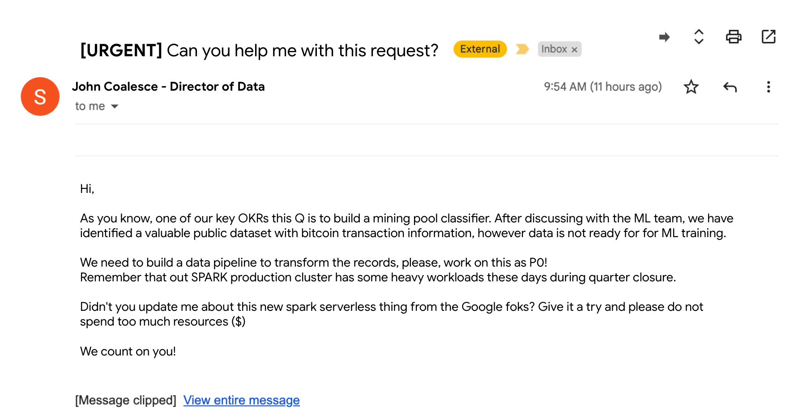
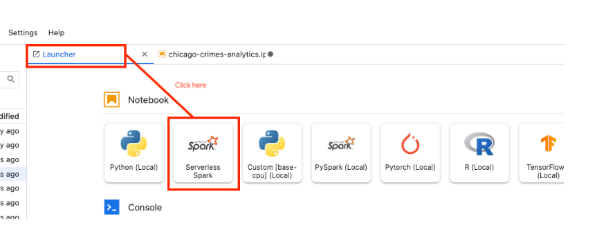
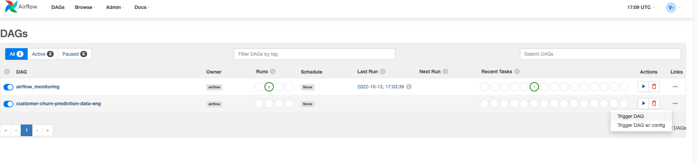
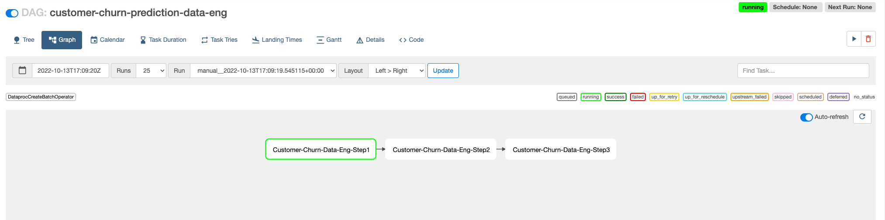
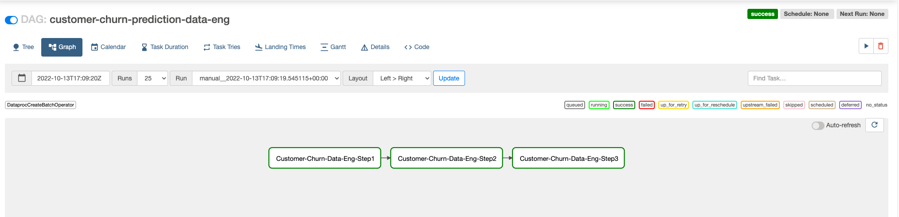

# Lab 1 - SPARK Hackfest - Data Engineering with SPARK


## Overview

Welcome to the **SPARK Hackfest!** <br><br>In this lab you will take on the role of a data engineer. You will be challenged to create a "production ready" data pipeline using SPARK. You will start by analyzing and understand the data from a familar Jupyter notebook interface.
Then, you will build a number of common data transformations to increase the data quality, and once you are ready to deploy the pipeline in production, you will refactor the code using Composer to make the process automated and repetable.


## Learning objectives

The lab includes studying and developing a number of common data engineering tasks, including: <br>
* Interactive data exploration of a dataset using interactive Spark Serverless from a managed Google Vertex managed notebook<br>
* Development of common data curation techniques using interactive Spark Serverless from a managed Google Vertex notebook <br>
* Development of a production data pipeline (DAG) using Cloud Composer, the pipeline will execute Spark in batch mode <br>

**_NOTE:_** The code provided in this lab is templatized, you will need to fill the code blocks marked with `INSERT_CODE_HERE` keyword.

For example:

* Show a couple of rows from the table using the `show` function
* Count the number of rows using the `count` function

```python
rawChurnDF._______INSERT_CODE_HERE_______(2,vertical=True)
print(rawChurnDF._______INSERT_CODE_HERE_______)
```
Code generated

```python
rawChurnDF.show(2,vertical=True)
print(rawChurnDF.count())
```

## Setup and Requirements


## Laboratory execution

### Introduction

It all starts when, on a quiet Monday morning, you receive the following email:



It seems a quite urgent task, so lets get to work! <br><br>  
First thing first:


It turns out that a *Mining Pool Classifier* is a predictive model that calculates, on an individual transaction basis, the likelihood (or susceptibility) that a this particular transaction has been generated via a mining pool. A mining pool is the pooling of resources by miners, who share their processing power over a network, to split the reward equally, according to the amount of work they contributed to the probability of finding a block.

A good use case can be the detection of dark pools.

The data that the email was refering to is located in the `crypto_bitcoin.transactions` dataset

Armed with your knowledge of pySPARK for data processing, one of the first questions likely to come up after receiving this assignment is: <br> 

*Where can I start to quickly and interactively analyze data?* <br>


A number of options are available, but since the nature of the task is exploratory, notebooks have established themselves as the industry standard interface for these initial data discovery workloads. But is it possible to start an interactive pySPARK session from a notebook without having to manage the process of deploying a cluster?


 [Dataproc serverless]( https://cloud.google.com/dataproc-serverless/docs) lets you run Spark interactive workloads without requiring you to provision and manage your own cluster. You just need to connect to a Vertex AI Jupyter Notebook and start using a PySpark session without the need to create or manage a cluster.

 Using Dataproc serverless is very well suited for your task asignement:

 * Accelerated time-to-market: Spark developers and data scientists can use notebooks for their development, data exploration, and machine learning use cases without having to set up clusters in advance.
* No ops: The Data team does not need to create and manage clusters for individual users.
* Cost effective: Serverless Spark sessions auto-scale as needed vs fixed size clusters created for individual users. The sessions are also not under-utilized like larger long-running clusters used for interactive development.

## Lab deployed objects

In your Google Cloud project, you will find the following list of elements already pre-provisioned:

* A Service Account (`s8s-lab-sa@<PROJECT_ID>.iam.gserviceaccount.com`) + roles required for lab execution
* A VPC (`s8s-vpc-<PROJECT_ID>`) + subnet (spark-snet) + firewall rules
* GCS bucket for data (`gs://s8s_data_bucket-<PROJECT_ID>`)
* GCS bucket for code (`gs://s8s_code_bucket-<PROJECT_ID>`)
* Seed data `telco_customer_churn_train_data.csv`
* A Google managed notebook (`s8s-spark-ml-interactive-nb-server`) with a predefined notebook
* Persistent History Server (dataproc) (`s8s-sphs-<PROJECT_ID>`)
* A BigQuery dataset (`customer_churn_ds`)
* A Container image for SPARK (`gcr.io/<PROJECT_ID>/customer_churn_image`)
* A Composer environment (`<PROJECT_ID>-cc2`)
* A Dataproc metastore (`s8s-dpms-<PROJECT_ID>`)

### Exploratory data analysis with dataproc serverless
 
1. From your Google Project, navigate to Vertex AI Managed notebooks and click on `OPEN JUPYTERLAB`

Follow this sequence:





Paste the value:

`spark.jars.packages=com.google.cloud.spark:spark-bigquery-with-dependencies_2.12:0.25.2`

2. You will see a pre-created notebook called `lab01-data_engineering.ipnby`, open it with the newly created Spark Serverless kernel
3. Complete the notebooks cells

Ok, it seems we have now a nice sequence of transformations that can generate a usable dataset. Although the notebook has served us as a tool for exploration and agile development, it is not a productive asset, we need to operativize the data transformations, and will be using Cloud Composer, a fully managed workflow orchestration service built on Apache Airflow.

### Operativize a production pipeline with Cloud Composer


1. From your Google Project, Open Cloud Shell
2. Execute: 

```bash
$> export PROJECT_ID=`gcloud config list --format "value(core.project)" 2>/dev/null`
$> gcloud storage cp gs://s8s_code_bucket-${PROJECT_ID}/setup_dag_files.sh .
$> ./setup_dag_files.sh
```
This will download the python files that contains the data transformations logic under the following folder:

```
dataeng
└── dag_pipeline
    ├── data_eng_dag_step_1.py
    ├── data_eng_dag_step_2.py
    └── data_eng_pipeline.py
```
NOTE: To showcase a Composer DAG with different steps, the notebook logic has been splitted in 3 different steps

Have a look at the `data_eng_dag_step_1.py` and `data_eng_dag_step_2.py`. Those files contains the very same logic you generated on the notebook.

The last file, `data_eng_pipeline.py`, contains the DAG logic.

3. Complete the code blocks on the  `data_eng_pipeline.py` file

4. Once the DAG is ready, you need to upload the DAG files to the Composer bucket, execute:
```bash

$> ./dataeng/dag_pipeline/upload_dag.sh

```

4.Trigger DAG execution from Cloud Composer
It might take a few minutes for Composer to process the new pipeline
Follow this sequence:







## Congratulations
This concludes the SPARK Hackfest - Data Engineering with SPARK!

Now, you go back to Google Mail and proudly answer your manager:

**ITS DONE! For once, data is ready to go!**


