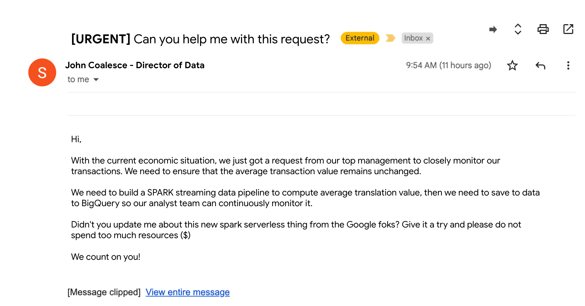
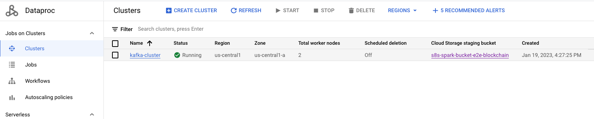
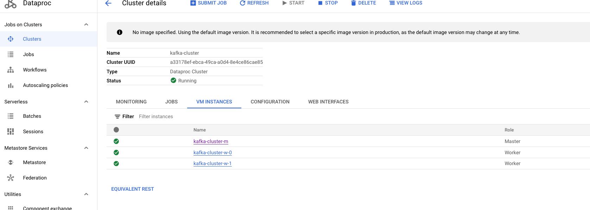
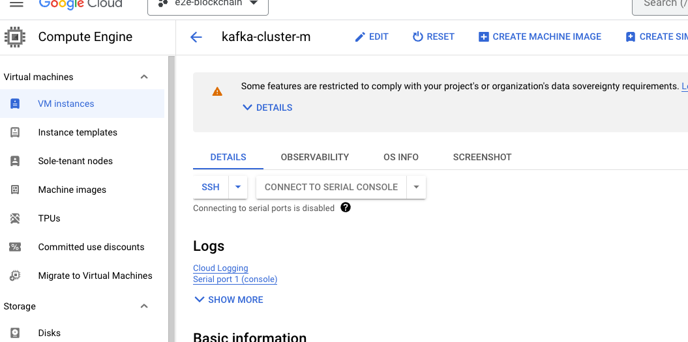
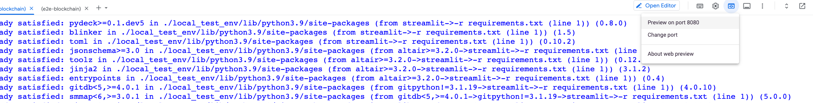
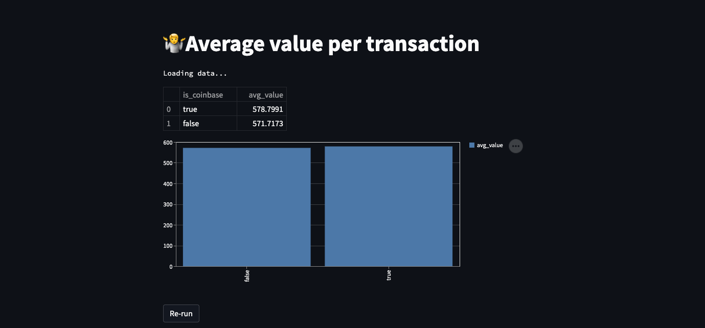

# Lab 2 - SPARK Hackfest - Data Streaming with SPARK


## Overview

Welcome to the **SPARK Hackfest!** <br><br>In this lab you will take on the role of a data engineer. You will be challenged to create a "production ready" data streaming data pipeline using SPARK. 
You will build a a continuos data pipeline that reads data from a messaging system, performs some data transformations and write the result to BigQuery


## Learning objectives

The lab includes studying and developing a number of common data engineering tasks, including: <br>

* Development of very simple producer application that generate events <br>
* Development of a streaming pipeline with windowing aggregates <br>


## Laboratory execution

### Introduction

It all starts when, on a quiet Tuesday morning, you receive the following email:



It seems a quite urgent task, so lets get to work! <br><br>  


 [Dataproc serverless]( https://cloud.google.com/dataproc-serverless/docs) lets you run Spark interactive workloads without requiring you to provision and manage your own cluster. 

 Using Dataproc serverless is very well suited for your task asignement:

 * Accelerated time-to-market: Spark developers and data scientists can use notebooks for their development, data exploration, and machine learning use cases without having to set up clusters in advance.
* No ops: The Data team does not need to create and manage clusters for individual users.
* Cost effective: Serverless Spark sessions auto-scale as needed vs fixed size clusters created for individual users. The sessions are also not under-utilized like larger long-running clusters used for interactive development.


### Start the KAFKA producer application
 
1. From your Google Project, navigate to the Dataproc clusters page and select tke `kafka-cluster`

2. Login into the master node


3. Copy the following scripts from the GCS bucket:

```bash
$> gcloud storage cp gs://s8s_code_bucket-${PROJECT_ID}/create_topic.sh .
$> gcloud storage cp gs://s8s_code_bucket-${PROJECT_ID}/produce_messages.sh .
$> gcloud storage cp gs://s8s_code_bucket-${PROJECT_ID}/check_messages.sh .
$> gcloud storage cp gs://s8s_code_bucket-${PROJECT_ID}/flush_messages.sh .
```

Now, execute the following scripts in the kafka master node machine:

1. Create topic
```bash
$> gcloud storage cp gs://s8s_code_bucket-${PROJECT_ID}/create_topic.sh .
```
2. Produce random events
```bash
$> gcloud storage cp gs://s8s_code_bucket-${PROJECT_ID}/produce_messages.sh .
```
NOTE: Execute `check_messages.sh` to make sure the messages are correctly sent and `flush_messages.sh` to reset the topic


### Start the SPARK streaming job using SPARK serverless

1. From your Google Project, Open Cloud Shell
2. Execute: 

```bash
$> cd end-to-end-data-analytics-with-spark-fintech/02-streaming/terraform/scripts-hydrated
$> source submit_structured_streaming.sh
```

This will trigger a new dataproc serverless job to compute the windowing average and write the output results to BigQuery (`transactions` table) every 1 minute.


### Deploy a simple streamlit app to check results in real time

1. From your Google Project, Open Cloud Shell
2. Execute: 

```bash
$> cd end-to-end-data-analytics-with-spark-fintech/02-streaming/terraform/scripts-hydrated
$> source launch_streamlit_local.sh
```
This will deploy a simple streamlit app that queries the BigQuey table on demand.
Once the script is executed, click on cloud shell web preview.

Click on the re-run button, the results should change every minute


NOTE: There is also a script called `deploy_app.sh`to fully deploy the app on Cloud Run

Finally, get the dataproc job id and cancel the execution:
```bash
$> gcloud dataproc batches list --region us-central1
#Copy the JOB_ID
$> gcloud dataproc batches cancel JOB_ID --region GCP_REGION
```


## Congratulations
This concludes the SPARK Hackfest - Data Streaming with SPARK!

Now, you go back to Google Mail and proudly answer your manager:

**ITS DONE! For once, data is ready to go!**


